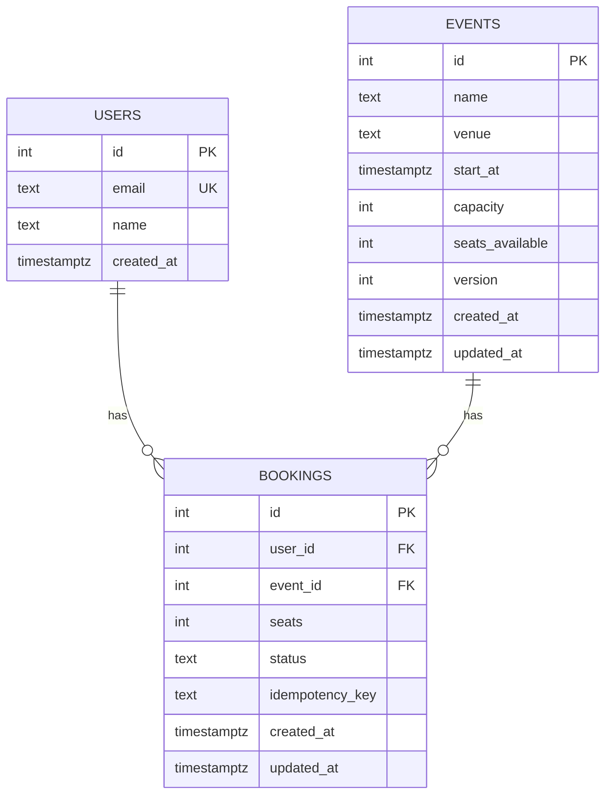
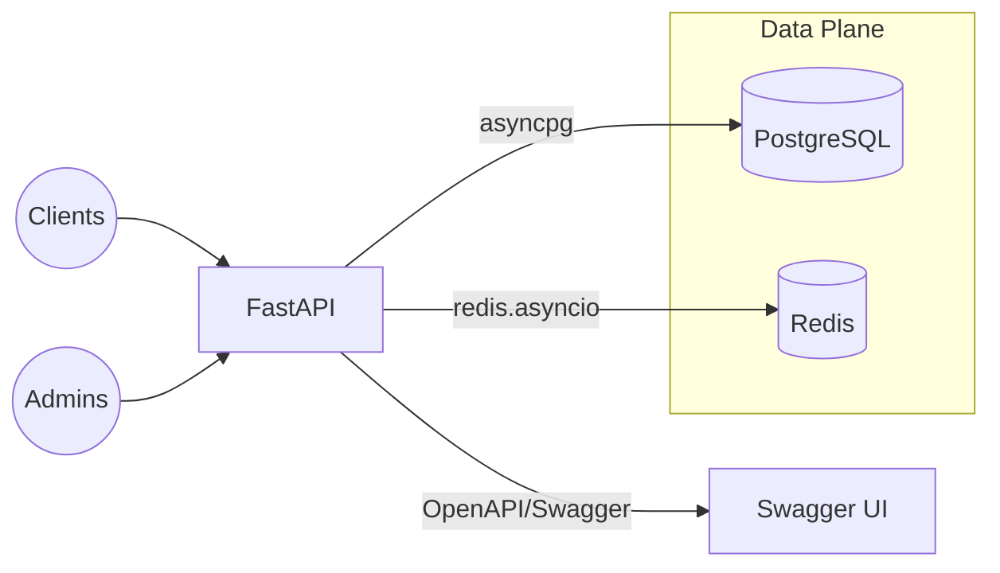

# Evently (Utsavam) - Backend Design Documentation

## Overview
Evently is a ticketing backend where users browse events, book/cancel tickets, and view history; admins manage events and view analytics. This document explains major design decisions, concurrency controls, data model, scalability strategy, APIs, and optional enhancements.

Stack: FastAPI, SQLAlchemy (async), PostgreSQL, Redis (async), Alembic, Uvicorn.

## Core Requirements Mapping
- Users: list/get events; book/cancel; booking history.
- Admins: CRUD events; analytics; list event bookings; seed demo.
- Concurrency safety: prevent overselling; handle spikes.

## Concurrency & Race Conditions
Goals: avoid overselling seats under high contention; provide idempotency; support graceful degradation if Redis is unavailable.

Techniques used:
- Pessimistic row locking in Postgres: `SELECT ... FOR UPDATE` on the `events` row during booking and capacity updates ensures single-writer semantics per event. Seats are decremented within the same transaction.
- Optional Redis token bucket fast-path: a per-event key `event:{event_id}:tokens` holds available seats. A Lua script atomically decrements if enough tokens exist. Outcomes:
  - True: proceed and commit booking transaction; DB still checks and decrements to remain source of truth.
  - False: immediate 409 Conflict (insufficient seats) without DB roundtrip.
  - None: missing key/Redis error; fall back to DB-only flow.
- Idempotency key on bookings: prevents duplicate bookings on retries; request with same `idempotency_key` returns existing booking.
- Bounded retries: transient serialization or lock timeouts can be retried (`MAX_RETRIES`).
- Cancellation restores seats: lock event row, increment `seats_available`, optionally refund Redis tokens.

Trade-offs:
- Redis is an accelerator, not the source of truth. The DB transaction validates and updates seats to maintain correctness.
- Pessimistic locking favors correctness and simplicity over maximum throughput; sharding/partitioning can mitigate hot-spot events.

## Database Design
Entities:
- users: id, email (unique), name, created_at
- events: id, name, venue, start_at, capacity, seats_available, version, timestamps
- bookings: id, user_id, event_id, seats, status (CONFIRMED/CANCELLED), idempotency_key, timestamps

Integrity rules:
- `seats_available` + sum(confirmed seats) == `capacity` invariant is enforced via transactional updates; admin capacity changes check existing confirmed seats.
- FK cascades delete bookings when an event/user is deleted.

Indexes:
- `events.start_at` for listing upcoming events
- `bookings.user_id`, `bookings.event_id` for history/analytics

ER Diagram (Mermaid):

## High-Level Architecture
Components:
- API service (FastAPI + Uvicorn)
- PostgreSQL (primary datastore)
- Redis (token buckets for hot-path concurrency)
- Alembic migrations

Diagram (Mermaid):

## Scalability Strategy
- Horizontal API scaling: stateless FastAPI instances behind a load balancer.
- DB connection pooling: tuned via `DB_POOL_SIZE` and `DB_MAX_OVERFLOW`.
- Caching/acceleration: Redis token bucket to short-circuit obvious conflicts under load.
- Hot-spot mitigation: because locks are per-event row, high-traffic single events serialize. Mitigations include: partition events across shards; pre-queue via Redis Streams or a message queue (e.g., RabbitMQ) to smooth bursts; or split seating pools by section.
- Read patterns: list/get endpoints use simple indexed queries; can be cached at CDN or application layer for popular events.
- Indexing: covered above; add composite indexes as analytics needs grow.
- Sharding (future): shard by `event_id % N` across logical databases for extreme concurrency; route bookings to shard-specific workers.

## Fault Tolerance & Degradation
- Redis failures: fall back to DB-only locking path; correctness maintained.
- DB failures: surface 5xx; idempotency prevents duplicates on client retries.
- Token reconciliation: admin updates call `init_tokens_for_event` to resync Redis counts from DB `seats_available`.

## Security
- Admin endpoints require `X-Admin-Key` header; rotate via `ADMIN_KEY` env var.
- Input validation with Pydantic; email normalization on user creation.
- Avoid leaking internals in errors; use appropriate HTTP status codes.

## API Summary
- Public:
  - GET `/health`
  - POST `/users`
  - GET `/events`
  - GET `/events/{event_id}`
  - GET `/users/{user_id}/bookings`
  - POST `/bookings`
  - DELETE `/bookings/{booking_id}`
- Admin (header `X-Admin-Key`):
  - GET `/admin/users`
  - POST `/admin/events`
  - PUT `/admin/events/{event_id}`
  - GET `/admin/events/{event_id}/bookings`
  - GET `/admin/analytics`
  - DELETE `/admin/events/{event_id}`
  - POST `/admin/seed_demo_data`

See OpenAPI draft in `docs/openapi.yaml`.

## Error Handling
- 400: validation errors, negative/zero seats, invalid capacity reductions.
- 401: missing/invalid admin key.
- 404: user/event/booking not found.
- 409: seat conflicts or duplicate email.
- 5xx: unexpected errors; retried internally where safe.

## Observability
- Structured logs from API; database slow query logs recommended.
- Metrics: request counts, p95 latency, booking conflicts vs success; DB/Redis pool usage.

## Optional Enhancements
- Waitlist: `waitlists` table with FIFO per event; on cancellation or capacity increase, pop and notify.
- Seat-level booking: add `seats` table and `booking_seats` junction; enforce unique `(event_id, seat_id)` with transactional locks.
- Notifications: webhook or email on waitlist promotion using a job queue.
- Advanced analytics: endpoints for most-booked events, cancellation rates, daily stats (materialized views or rollups).

## Deployment
- Recommended: Render/Railway/Heroku with managed Postgres & Redis.
- Start command: `uvicorn backend.app.main:app --host 0.0.0.0 --port $PORT`.
- Run migrations on deploy: `alembic upgrade head`.

## Load Testing (suggested approach)
- Locust/K6 scripts to simulate thousands of concurrent bookings to the same event; expect conflicts equal to `requests - capacity`.

## Risks & Future Work
- Single-row hot spot on ultra-popular events → consider sharding or queue-based allocation.
- Redis drift if external updates bypass admin endpoints → add a periodic reconciler job.
- Strengthen authentication/authorization for multi-tenant admins.
